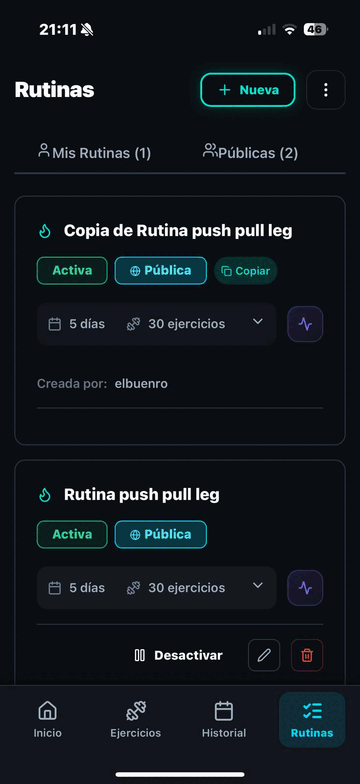

<p align="end">
   <strong>🌐 Change language:</strong><br>
   <a href="README.es.md">
    
  </a>&nbsp;&nbsp;&nbsp;
  <a href="/README.md">
    
  </a>
</p>

# 💪 Gymtracker v2

<p align="center">
  
</p>

## 📜 About

`gymtrackerv2` is the follow-up to [Fittracker](https://github.com/Nachopuerto95/Fittracker): I kept the part I actually used (the gym side) and rebuilt it from scratch with a better data model, a nicer UI and a stack I'm happier to work on.

The idea is simple: you build **routines** by dragging exercises around, then when you go to the gym you run them as a **session** that tracks sets, reps and weight in real time. Everything you complete is stored as a `WorkoutSession` so you can go back and see what you actually did in the calendar and the stats.

## ✨ Features

- **Auth** with JWT, token stored in `localStorage`, event-based sync (logout propagates across tabs).
- **Exercises**: library of exercises with search and filters.
- **Routine builder**: drag-and-drop with `@dnd-kit`, reorder and swap exercises.
- **In-session tracker**: run a routine, mark sets done, log weight/reps, rest timers.
- **History & calendar**: every session saved, filterable by date.
- **State management**: Zustand for client state, React Query-style patterns on the data layer.
- **Animations**: framer-motion for transitions, react-hot-toast for feedback.
- Backend hardened with `helmet`, `compression`, CORS with dynamic origin and `express-rate-limit`.

## 🧱 Stack

**Backend (`backend/`)**
- Node.js (ES modules) + Express
- MongoDB
- `helmet`, `compression`, `cors` (dynamic origin), `express-rate-limit`
- `jest` for tests
- nodemon

**Frontend (`frontend/`)**
- React 19 + Vite 7
- Tailwind CSS v4
- Zustand (state)
- `@dnd-kit` (drag-n-drop)
- `framer-motion` (animations)
- `react-hot-toast`
- `react-router-dom`
- `axios`
- `lucide-react` (icons)
- `date-fns`

## 🔧 Run locally

```bash
# Backend
cd backend
npm install
npm run dev        # http://localhost:5000

# Frontend
cd frontend
npm install
npm run dev        # http://localhost:5173
```

You'll need a `.env` in `backend/` with `MONGO_URI`, `JWT_SECRET` and allowed `CORS_ORIGINS`.

## 🚀 Deploy

Both pieces run on Fly.io as separate apps, so frontend and backend can scale and redeploy independently.

| Piece | Fly app | Region |
|---|---|---|
| Backend | `backend-wandering-sunset-1475` | LHR |
| Frontend | `frontend-billowing-pine-2384` | LHR |

## 📂 Layout

```
gymtrackerv2/
├── backend/
│   ├── src/
│   │   ├── controllers/   # auth, routine, exercise, workout
│   │   ├── models/        # User, Routine, Exercise, WorkoutSession
│   │   ├── routes/
│   │   └── middleware/
│   ├── server.js
│   └── fly.toml
└── frontend/
    ├── src/
    │   ├── pages/         # Login, Home, Workout, Exercises, Calendar, Routines, RoutineBuilder
    │   ├── components/
    │   ├── stores/        # Zustand stores
    │   └── services/      # axios clients
    ├── vite.config.js
    └── fly.toml
```

## 🛠️ API surface

```
POST   /api/auth/signup
POST   /api/auth/login
GET    /api/auth/me

GET    /api/exercises
GET    /api/routines
POST   /api/routines
PATCH  /api/routines/:id
DELETE /api/routines/:id

GET    /api/workouts
POST   /api/workouts           # save a finished session
```

## 🪜 What changed from Fittracker

- Split backend and frontend into two Fly.io apps (easier deploys, independent scaling).
- Dropped the nutrition side and put all the focus on the gym workflow.
- Replaced React context + manual fetch with Zustand + axios clients.
- Routine builder went from a form to a real drag-and-drop interface.
- Tailwind v4 + lucide + framer-motion made the UI feel like an actual product instead of a school project.
